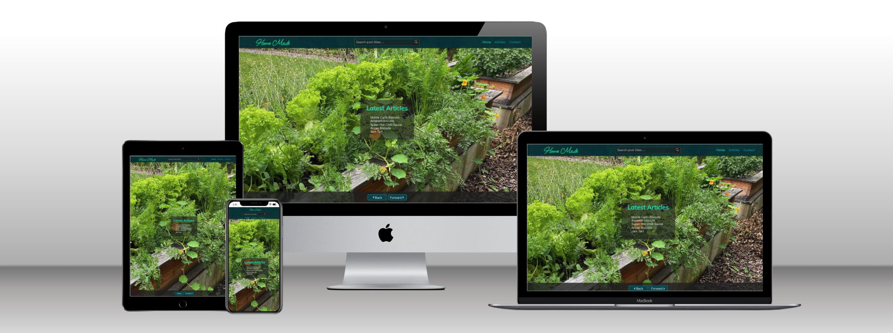

# Home Made

## React Contentful Headless CMS Blog Project.

### Project

Create a blog using React 18 and Contentful headless CMS.

Focus in this project was:

1. Learn to implement React 18 functional components.
2. React Router Dom v6 routing.
3. Research and setup Contentful content models.
4. Access the Contentful API to create a blog.
5. Learn about React hooks.
6. Practice and learn ES6 array methods and syntax.

### Content models and fields.

- **Blog Post model**

  - Image (Media)
  - Title (Short text)
  - Slug ( Short text)
  - Description (Long text)
  - Post Body (Long Text)
  - Publish Date (Date & Time)
  - Post Author (Reference)

- **Author model**
  - Author Name (Short text)
  - Author Introduction (Long text)
  - Author Bio (Long text)
  - Author Image (Media)

Within the blog posts, tags were created for each article.

### Added NPM Dependencies

- classnames: ^2.3.1
- contentful: ^9.1.33
- framer-motion: ^7.0.0
- markdown-to-jsx: ^7.1.7
- node-sass: ^7.0.1
- normalize.css: ^8.0.1
- react-icons: ^4.4.0
- react-router-dom: ^6.3.0

### Styling

I used node-sass (SCSS) for the entire project, together with classnames and css modules. As a learning experience, my goal was
to complete the project without using a css framework such as Bootstrap or Material UI.

Media queries have been added to make the site responsive accross a variety of screens from desktops to mobile. Overall
I'm happy with the outcome, although it is far from complete. I plan to refine the navbar to include a toggle button and
offcanvas mobile menu.

Learning the required syntax to implement SCSS, css modules, in React 18 was a steep learning curve. I still have a lot to learn
to make the most of all Sass has to offer. Overall, it does make writing CSS easier as it cuts duplication.

### Deployment

I deployed the project to Netlify. Per Netlify documentation, I added a plain text file to the public root directory.

The file should be named `_redirects` with no file extension. Contents in the file as follows.

```text
/*    /index.html  200
```

This allows the Netlify server to redirect 404 errors to the required page. In my case, I added a custom 404 error page so
all 404 errors are redirected to my custom page.

Overall the process of deploying was simple and straight forward using the Netlify admin panel.

### Homemade API

There are now three branches of this project in addition to the main branch which continues to access data from Contentful headless CMS.

1. `homemade-contentful` <br />
   Accesses data from the Contentful headless CMS.

2. `homemade-json` <br />
   Accesses data from json files in in `src/data` directory.  <br />
   This version was the transitional version to prepare for accessing data from the Homemade API.

3. `homemade-api-data` <br />
   This version fetches data from the Homemade API serving data from a postgreSQL database.

Source code for the Homemade API can be found in the [homemade-server-api](https://github.com/daidensacha/homemade-server-api) repo.
